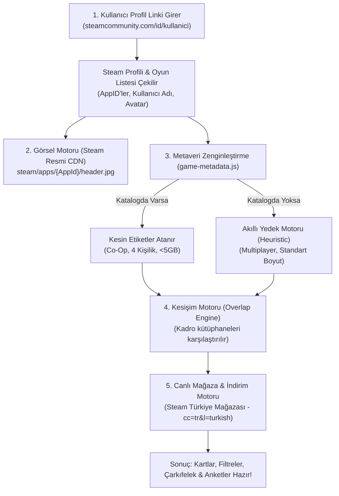

# 🎮 SteamSquad — Veri Akışı & Mimari Çalışma Mantığı

Bu doküman, **SteamSquad** Chrome eklentisinin bir Steam profil linki girildiği andan itibaren veriyi nasıl işlediğini, görselleri ve etiketleri nasıl çektiğini, katalogda olmayan oyunları nasıl yönettiğini ve canlı indirimleri nasıl ekrana yansıttığını adım adım açıklamaktadır.

---

## 📊 1. Genel Veri Akış Şeması

---

## 🔍 2. Adım Adım Çalışma Prensipleri

### 1. Adım: Profil Ayrıştırma & Oyun ID'lerinin Alınması
Kullanıcı `steamcommunity.com/id/MrHarun09` veya bir SteamID64 girdiğinde:
1. Eklenti Steam Community servisine bağlanarak profilin herkese açık verilerini ayrıştırır.
2. Kullanıcının profil adı (`Rek'Na`) ve avatar resmi alınır.
3. Kullanıcının sahip olduğu oyunların adları ve Steam'deki benzersiz kimlik numaraları olan **`AppID`** listesi (Örn: Counter-Strike 2 = `730`, Phasmophobia = `739630`, Lethal Company = `1966720`) hafızaya alınır.

---

### 2. Adım: Görsellerin Yüklenmesi (Steam Resmi CDN'i)
Steam platformundaki her oyunun dünyada tek bir `AppID` numarası vardır. Steam, tüm oyun afişlerini ve kapaklarını standart bir CDN (İçerik Dağıtım Ağı) link şablonunda barındırır:
- **Kapak Görseli Şablonu:** `https://cdn.akamai.steamstatic.com/steam/apps/{AppID}/header.jpg`
- **Avatar Görselleri:** `https://avatars.steamstatic.com/...`

> **Avantajı:** Görseller hiçbir harici sunucuya veya üçüncü taraf API'ye ihtiyaç duymadan, doğrudan Steam'in orijinal yüksek hızlı sunucularından anında çekilir.

---

### 3. Adım: Oyun Bilgilerini Zenginleştirme (`game-metadata.js`)
Steam'den sadece oyunun adı ve numarası gelir. Eklentinin *"Bu oyun Co-Op mu yoksa PvP mi?", "Kaç kişilik?", "Boyutu 5 GB'tan küçük mü?"* filtrelerini çalıştırabilmesi için oyunun özelliklerini bilmesi gerekir.

Burada iki seviyeli akıllı bir mekanizma çalışır:

#### A) Katalogdaki Popüler Oyunlar (400+ Oyun):
Eğer oyun yerleşik `src/services/game-metadata.js` kataloğunda kayıtlıysa (Örn: *CS2, Helldivers 2, Valheim, Lethal Company, Left 4 Dead 2, Phasmophobia, GTA V* vb.):
- **Mod:** `coop` *(Co-Op / PvE)*, `pvp` *(Rekabetçi)*, `party` *(Parti)*, `survival` *(Hayatta Kalma)*
- **Kişi Kapasitesi:** `4`, `5`, `8`, `10`, `100` vb. (Kadro kişi sayısı uyumluluk kontrolü için)
- **İndirme Boyutu:** `<5 GB` *(Küçük/Hızlı İndirilebilir)*, `5-20 GB` *(Orta)*, `>20 GB` *(Büyük)*

#### B) Katalogda Olmayan Yeni / Niş Oyunlar (Akıllı Yedek Motor):
Eğer kütüphanede listede bulunmayan yeni çıkmış bağımsız veya az bilinen bir oyun varsa:
- Eklenti bu oyunu **kesinlikle yok saymaz veya gizlemez**.
- **Heuristic Fallback (Akıllı Tahmin Motoru)** devreye girer.
- Oyun adına ve tür ipuçlarına bakarak varsayılan *"Multiplayer • Standart Boyut"* etiketlerini atar.
- **Sonuç:** Kütüphanedeki her oyun eksiksiz olarak listelenir.

---

### 4. Adım: Kesişim Motoru (`overlap-engine.js`)
Kadroda aktif olan oyuncuların kütüphaneleri birleştirilir ve anlık olarak karşılaştırılır:
- **HERKESTE VAR:** Kadrodaki tüm oyuncuların istisnasız sahip olduğu oyunlar.
- **1 KİŞİDE YOK:** Kadroda sadece 1 kişinin kütüphanesinde eksik olan oyunlar (Örn: *Ahmet hariç herkeste var*).
- **2 KİŞİDE YOK:** Kadroda 2 kişinin kütüphanesinde eksik olan oyunlar.

---

### 5. Adım: Canlı Türkiye Mağazası Fiyat & İndirim Motoru
Kadroda 1 veya 2 kişide eksik olan bir oyun listelendiğinde:
1. Eklenti arka planda Steam Store API'sine Türkiye parametreleriyle (`cc=tr&l=turkish`) bağlanır.
2. Oyunun güncel Türkiye fiyatı ve indirim oranı sorgulanır:
   - **İndirim Varsa:** `-%30 $6.64 USD` (Yeşil rozet)
   - **Ücretsizse:** `Ücretsiz`
   - **Normal Fiyatsa:** `$5.79 USD`
3. Çekilen mağaza fiyatı, gereksiz ağ trafiğini önlemek için tarayıcıda **6 saat boyunca önbelleklenir** (`chrome.storage.local`).

---

## 🔒 3. Güvenlik & Gizlilik İlkeleri
- **Şifresiz & Girişsiz:** Kullanıcılardan hiçbir zaman Steam şifresi, e-posta veya giriş bilgisi istenmez.
- **Sıfır Sunucu Maliyeti:** Tüm hesaplamalar ve eşleştirmeler doğrudan kullanıcının kendi tarayıcısında (Client-side) gerçekleşir.
- **Yerel Depolama:** Kadrolar ve ayarlar yalnızca kullanıcının yerel tarayıcı hafızasında (`chrome.storage.local`) saklanır.
