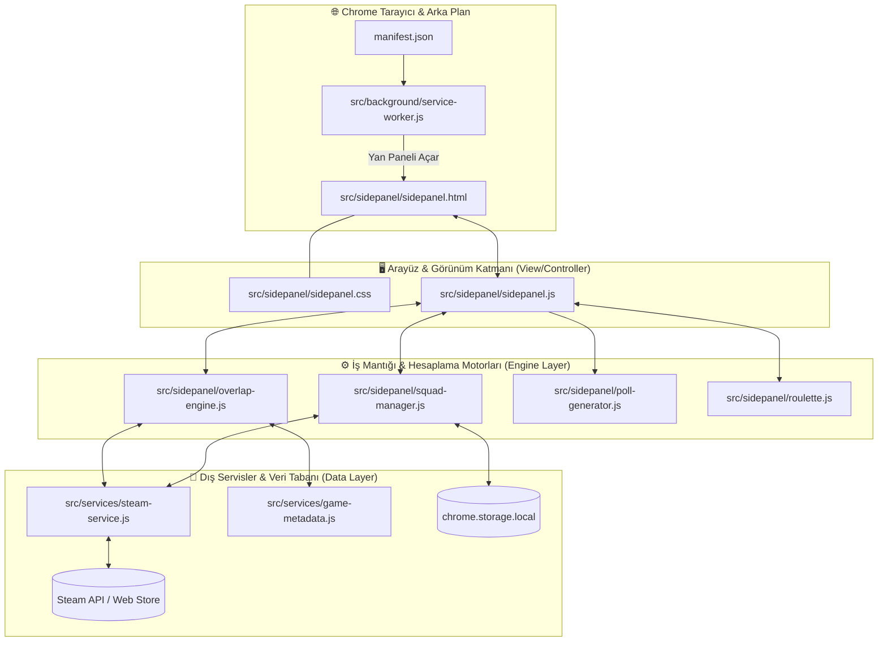

# 🏗️ SteamSquad — Uygulama Mimarisi & Çalışma Mantığı

Bu doküman, **SteamSquad** Chrome eklentisinin genel dosya yapısını, bileşenler arasındaki ilişkileri, yaşam döngüsünü ve uçtan uca veri akışını açıklamaktadır.

---

## 🗺️ 1. Genel Mimari Şeması



---

## 📂 2. Dosya Hiyerarşisi ve Görev Dağılımı

### 1. Giriş ve Arka Plan Katmanı
* **`manifest.json`**: Manifest V3 yapılandırmasıdır. Eklenti izinlerini (`sidePanel`, `storage`, `clipboardWrite`), arka plan servis çalışanını ve host izinlerini tanımlar.
* **`src/background/service-worker.js`**: Tarayıcının arka planında çalışır. Eklenti simgesine tıklandığında yan paneli (`sidepanel.html`) açar.

### 2. Arayüz ve Görünüm Katmanı (Presentation Layer)
* **`src/sidepanel/sidepanel.html`**: Tek Sayfalı Uygulama (SPA) şablonudur. 4 ana sekmeden oluşur:
  * **Kadro (`#tab-squad`)**: Arkadaş ekleme, ekip oluşturma (preset) ve kütüphane listesi.
  * **Oyunlar (`#tab-matches`)**: Ortak oyun listesi, filtreler, arama ve Steam'de başlat butonları.
  * **Anket (`#tab-poll`)**: Discord ve WhatsApp için tek tıkla kopyalanabilir anket şablonları.
  * **Çark & Veto (`#tab-roulette`)**: Sesli çarkıfelek ve sırayla eleme yapılan Veto Arenası.
* **`src/sidepanel/sidepanel.css`**: Steam Dark temasına özel stilleri, animasyonları, butonları, akordiyon ve grid yerleşimlerini içerir.
* **`src/sidepanel/sidepanel.js` *(Application Controller)*:** Uygulamanın orkestra şefidir. Kullanıcı etkileşimlerini yakalar, alt motorları koordine eder ve DOM'u günceller.

### 3. İş Mantığı ve Hesaplama Motorları (Engines)
* **`src/sidepanel/squad-manager.js`**: Kadro yöneticisidir. Oyuncu ekleme, çıkarma, aktiflik durumları (`checkbox`), hazır ekip paketleri (`presets`) ve `chrome.storage` kalıcı hafıza senkronizasyonunu yönetir.
* **`src/sidepanel/overlap-engine.js`**: Kütüphane eşleştirme motorudur. Aktif oyuncuların oyunlarını kesiştirerek gruplar:
  * **Full Matches (%100):** Herkeste olan oyunlar.
  * **N-1 Matches:** Sadece 1 kişide eksik olan oyunlar (kimde eksik olduğunu belirtir).
  * **N-2 Matches:** Sadece 2 kişide eksik olan oyunlar.
* **`src/sidepanel/poll-generator.js`**: Ortak oyunları Discord ve WhatsApp için emojili, numaralandırılmış anket şablonlarına dönüştürür.
* **`src/sidepanel/roulette.js`**:
  * `RouletteEngine`: HTML Canvas üzerinde dönen, ses efektli ve sürtünmeli çarkıfelek simülasyonu.
  * `VetoArenaEngine`: Oyuncuların sırayla istemedikleri oyunları elediği turnuva motoru.

### 4. Dış Servisler ve Veri Katmanı
* **`src/services/steam-service.js`**: Steam Community ve Web API ile haberleşir. Profil isimlerini SteamID64'e dönüştürür, sahip olunan oyunları çeker ve canlı Türkiye mağaza indirim/fiyat bilgilerini sorgular.
* **`src/services/game-metadata.js`**: 400+ popüler oyunun yerel veritabanıdır (Co-op, PvP, Max Oyuncu Sayısı, İndirme Boyutu GB vb.).

---

## 🔄 3. Uçtan Uca Veri Akışı (Senaryo)

```text
[Kullanıcı] 
  │  1. Profil linki veya kullanıcı adı girip "+ Ekle" butonuna basar
  ▼
[sidepanel.js]
  │  2. İstegi yakalar -> squadManager.addMember(...)
  ▼
[squad-manager.js]
  │  3. Oyuncu verilerini çeker -> steam-service.js
  ▼
[steam-service.js]
  │  4. Steam'den avatar, kullanıcı adı ve sahip olduğu AppID'leri alır
  ▼
[squad-manager.js]
  │  5. Oyuncuyu kadroya ekler, chrome.storage'a kaydeder ve "onSquadUpdated" sinyali yayınlar
  ▼
[sidepanel.js]
  │  6. Sinyali alır: Kadro kartını ekrana çizer ve overlapEngine.calculateOverlap(...) çağırır
  ▼
[overlap-engine.js]
  │  7. Aktif kadrodaki tüm kütüphaneleri kesiştirir, game-metadata.js etiketleriyle zenginleştirir
  ▼
[Kullanıcı Sekme Değiştirir]
  ├──> "Oyunlar" Sekmesi : Eşleşen oyunlar canlı indirim etiketleriyle listelenir.
  ├──> "Anket" Sekmesi   : PollGenerator tek tıkla Discord/WhatsApp metni üretir.
  └──> "Çark" Sekmesi    : RouletteEngine kalan oyunları çark dilimlerine yerleştirir.
```
