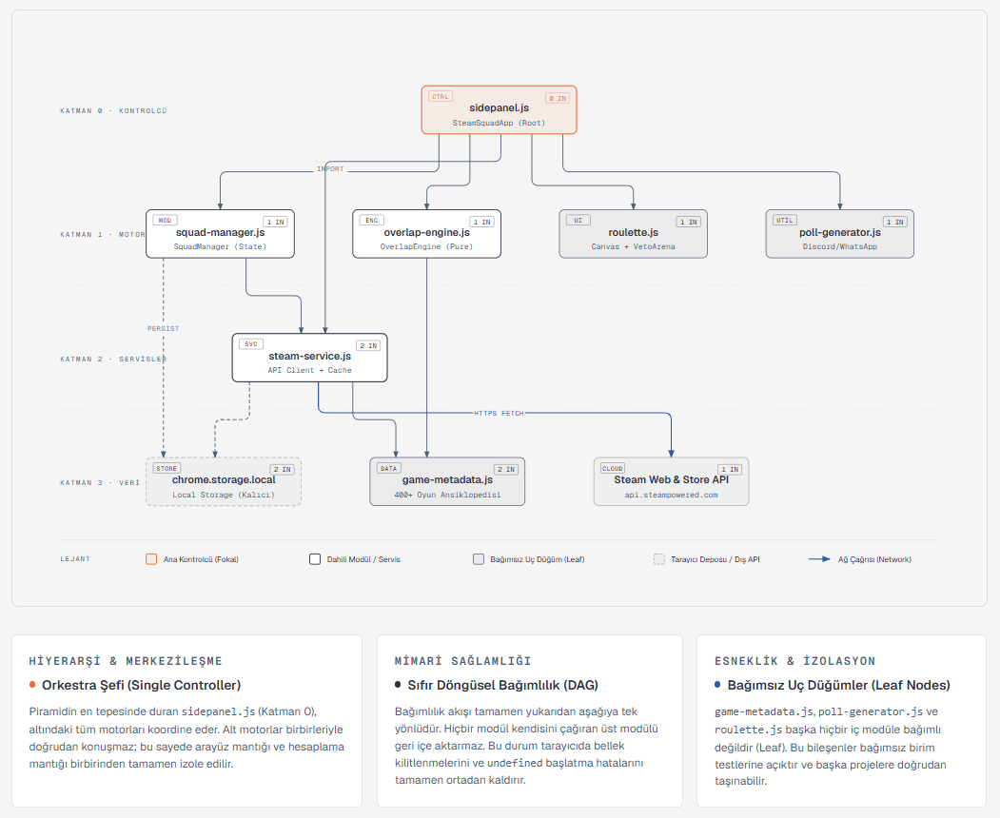
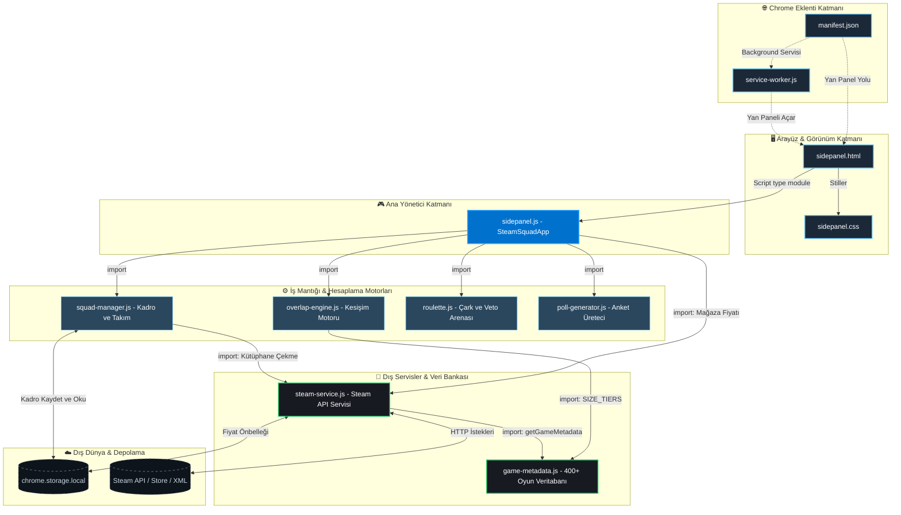

# 📊 SteamSquad — Bağımlılık Grafiği (Dependency Graph)

Bu doküman, **SteamSquad** Chrome eklentisinin modülleri arasındaki tüm `import` ve bağımlılık ilişkilerini görsel ve teknik olarak açıklamaktadır.

---

## 🗺️ 1. Görsel Bağımlılık Şeması

<b>📐 Mermaid Şemasını ve Kaynak Kodunu Görüntüle</b>

---

## 📋 2. Modül İçe Aktarım Tablosu (Imports & Exports)

| Dosya | İçe Aktardığı Modüller (Imports) | Kimler Tarafından Kullanılıyor? | Görevi |
| :--- | :--- | :--- | :--- |
| **`sidepanel.js`** | `squad-manager.js` `overlap-engine.js` `poll-generator.js` `roulette.js` `steam-service.js` | `sidepanel.html` | Uygulamanın orkestra şefidir (Application Controller). Arayüz ve motorları koordine eder. |
| **`squad-manager.js`** | `steam-service.js` | `sidepanel.js` | Kadro ve takımları yönetir, `chrome.storage` kalıcı kaydını tutar. |
| **`overlap-engine.js`** | `game-metadata.js` (`SIZE_TIERS`) | `sidepanel.js` | Aktif üyelerin kütüphanelerini kesiştirir (Herkeste Var, 1 Eksik, 2 Eksik). |
| **`steam-service.js`** | `game-metadata.js` (`getGameMetadata`) | `sidepanel.js` `squad-manager.js` | Steam API, Community XML ve canlı mağaza fiyatlarını çeker. |
| **`game-metadata.js`** | *(Hiçbiri - Bağımsız)* | `overlap-engine.js` `steam-service.js` | 400+ popüler oyunun mod, kapasite ve boyut veritabanıdır. |
| **`poll-generator.js`** | *(Hiçbiri - Bağımsız)* | `sidepanel.js` | Discord ve WhatsApp için anket metni ve pano kopyalama yardımcısı. |
| **`roulette.js`** | *(Hiçbiri - Bağımsız)* | `sidepanel.js` | HTML Canvas çarkıfelek ve Veto eleme arenası motorudur. |

---

## 🎯 3. Mimari Özellikler ve Çıkarımlar

1. **Sıfır Döngüsel Bağımlılık (No Circular Dependencies):**
   * Bağımlılık akışı tamamen yukarıdan aşağıya tek yönlüdür.
   * Hiçbir dosya kendisini çağıran bir üst modülü tekrar import etmez. Bu sayede tarayıcıda bellek kilitlenmesi veya `undefined` değişken hataları oluşmaz.

2. **Bağımsız Uç Düğümler (Leaf Nodes):**
   * `game-metadata.js`, `poll-generator.js` ve `roulette.js` başka hiçbir iç modüle bağımlı değildir. 
   * Bu modüller istendiğinde projeden sökülüp başka bir projede tek başına çalıştırılabilir (Loose Coupling).

3. **Merkezi Veri Akışı (Single Controller):**
   * Motorlar (`squad-manager`, `overlap-engine`, `roulette`) birbirleriyle doğrudan konuşmaz. 
   * Tüm veri akışı ve senkronizasyon `sidepanel.js` üzerinden merkezi olarak yönetilir.
